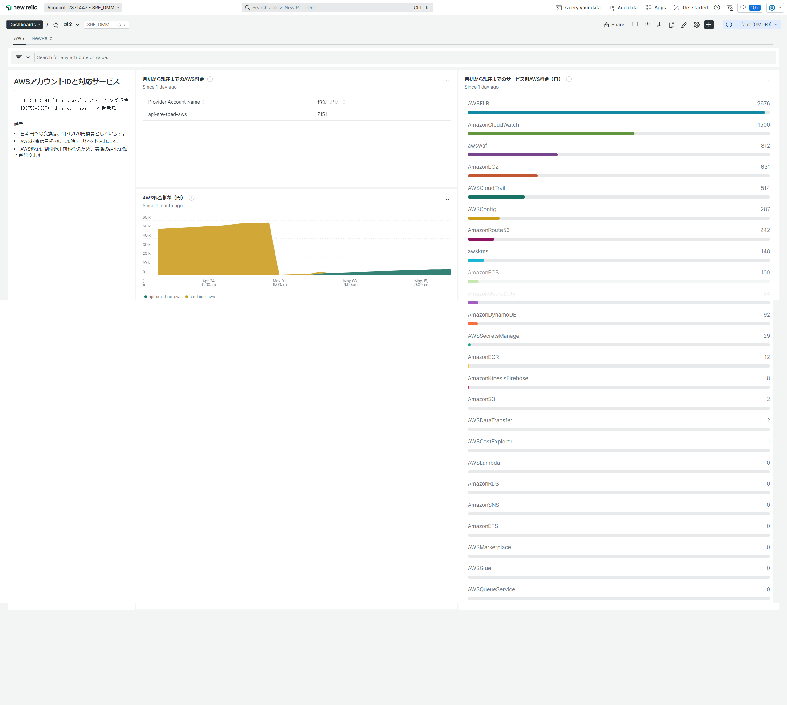

# Terraform template for NewRelic Dashboard

## このツールについて

Terraform による NewRelic ダッシュボード導入のためのテンプレートです。  
最小限の設定で NewRelic ダッシュボードを作成することが出来ます。

## リリースノート

リリースノートについては、[コンフルエンス](https://confl.arms.dmm.com/pages/viewpage.action?pageId=1100764234)を参照してください。

## ダッシュボードの説明

本テンプレートで作成可能なダッシュボードは以下の通りです。

* aws_newrelic_charge
* core_web_vitals
* circleci

### aws_newrelic_charge

AWS と NewRelic の料金推移を可視化します。




### core_web_vitals

Core Web Vitals を可視化します。  
Core Web Vitals については、https://web.dev/i18n/ja/vitals/ を参照してください。


### circleci

CircleCI の実行状況を可視化します。  
詳細については、https://newrelic.com/instant-observability/circleci/39109d3d-b1d8-4366-8ca9-b8925005f727 を参照してください。


## 事前準備

NewRelic アカウントが未取得の場合は、作成申請を行ってください。  

https://confl.arms.dmm.com/pages/viewpage.action?pageId=947665682  
Q. アカウントの開設／閉鎖をするにはどうしたら良いですか

なお、aws configure で `terraform` というプロファイル名の AWS 認証情報が作成済みであるものとします。  
※`terraform` は例です。

プロファイルが未作成の場合は、【[AWS 認証情報ファイルの作成を行います。](../alert/README.md#使い方)】を参考にプロファイルを作成してください。

### aws_newrelic_charge

AWS の料金をクエリするには、AWS polling integrations の設定を行い、Billing を有効にしてください。

https://docs.newrelic.com/jp/docs/infrastructure/amazon-integrations/connect/connect-aws-new-relic-infrastructure-monitoring/

NewRelic の料金をクエリするための事前準備はありません。

### core_web_vitals

Browser が設定されており、`FROM PageViewTiming SELECT count(*)` でクエリ結果が正常に出力されることを確認してください。

https://docs.newrelic.com/jp/docs/browser/browser-monitoring/getting-started/introduction-browser-monitoring/

### circleci

CircleCI の Webhooks 設定を行います。  
設定方法については、https://docs.newrelic.com/docs/logs/forward-logs/circleci-logs/ を参照してください。

## 使い方

以下は手作業で terraform を実行する際の手順です。

※`example` にはサンプル設定が入っています。

1. ディレクトリを移動します。複数環境（STG/PROD）で設定を分ける場合は、それぞれのディレクトリ（staging, production）を使用してください。
    ```bash
    $ cd dashboard/src/environments/*****
    ```
2. `locals.tf` 内の変数を設定します。
    ```
    nr_account_id  ･･･ Dashboard を作成する NewRelic アカウント ID
    nr_license_key ･･･ Type が USERの API キー

    exchange_rate               ･･･ ドル円の為替レート
    core_web_vitals_domain_name ･･･ Core Web Vitals の出力対象とするドメイン名
    circleci_organization_name  ･･･ CircleCI のオーガニゼーション名
    ```
3. `backend.cfg` 内の変数を設定します。
    ```
    bucket ･･･ <AWS アカウント ID> を S3 バケットを作成する数字 12 桁の AWS アカウント ID に書き換える
    ```
4. AWS 認証情報の読み込み
    ```bash
    $ export AWS_PROFILE=terraform
    ```
5. terraform を実行します。
    ```bash
    $ terraform init -backend-config="backend.cfg"
    $ terraform plan
    $ terraform apply
    ```

※任意  
初回の terraform apply 以降は NewRelic の画面上からダッシュボードの設定変更を行うことを想定しています。  
以下のコマンドを実行し、ダッシュボードのリソースを Terraform の管理下から削除してください。

```bash
$ terraform state rm module.dashboard_aws_newrelic_charge.newrelic_one_dashboard.aws_newrelic_charge
$ terraform state rm module.dashboard_core_web_vitals.newrelic_one_dashboard.core_web_vitals
$ terraform state rm module.dashboard_circleci.newrelic_one_dashboard.circleci
```
