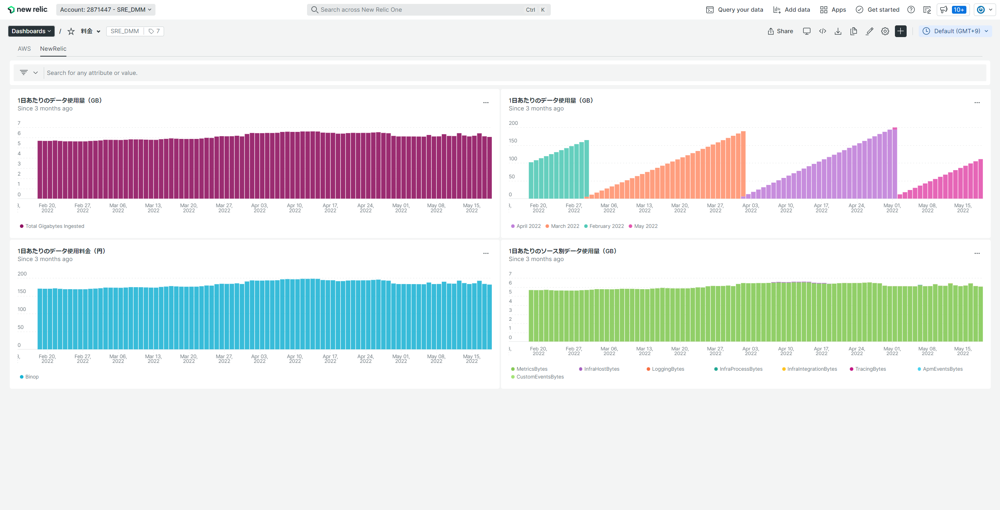

# モジュールの説明

本モジュールで作成されるダッシュボードは以下の通りです。

## aws_newrelic_charge

AWS と NewRelic の料金推移を可視化します。

# 事前準備

## aws_newrelic_charge

AWS の料金をクエリするには、AWS polling integrations の設定を行い、Billing を有効にする必要があります。

Billing を有効にするために、先に [aws](https://git.dmm.com/sre-team/newrelic-template/tree/main/aws) のデプロイを実施してください。

参考：https://docs.newrelic.com/jp/docs/infrastructure/amazon-integrations/connect/connect-aws-new-relic-infrastructure-monitoring/
