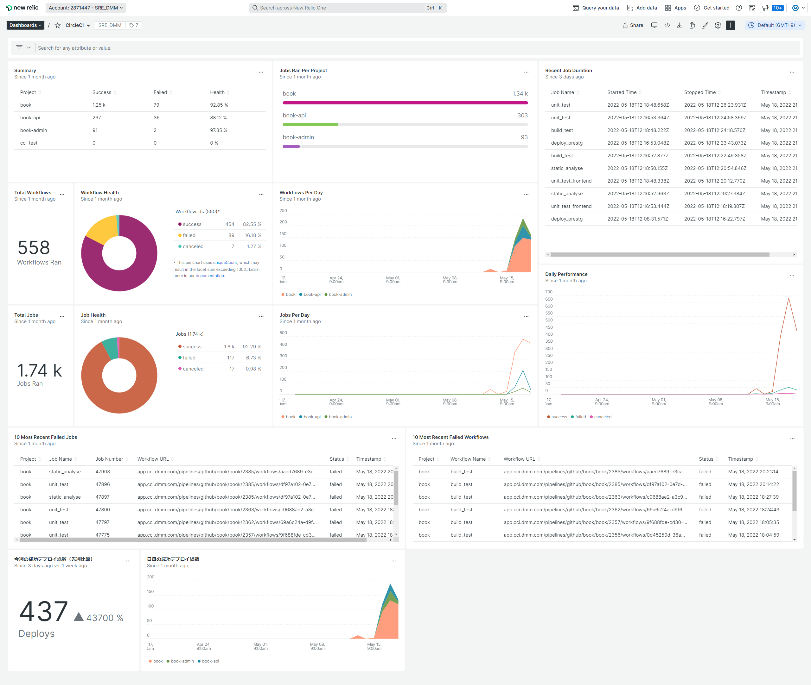

# モジュールの説明

本モジュールで作成されるダッシュボードは以下の通りです。

## circleci

CircleCI の実行状況を可視化します。  
詳細については、https://newrelic.com/instant-observability/circleci/39109d3d-b1d8-4366-8ca9-b8925005f727 を参照してください。

# 事前準備

## circleci

CircleCI の Webhooks 設定を行います。  
設定方法については、https://docs.newrelic.com/docs/logs/forward-logs/circleci-logs/ を参照してください。
